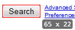
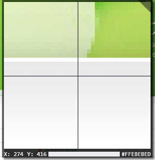

# Rooler
Utilities for pixel-perfect analysis and measurement of graphics. Created for designers to aid common tasks such as redlining and analysis of layouts. Rooler uses the on-screen graphics and can be used for any graphics- from static images to HTML in your browser to the UI of a running application. Rooler was originally inspired by the excellent OSX application [xScope](http://xscopeapp.com/).

## Download

This project, for now, only works with Windows. Check out the binaries [here](https://github.com/peteblois/rooler/releases).

You will need the latest .NET framework installed on your machine.

## Build

If you want to work with the source of this project, instead of a binary, you will need at least `msbuild` available from the command line. Optionally, you can also just open [the solution file](./src/Rooler.sln) and build using Visual Studio.

The resulting build will be placed in `build/` at the root of the project.

## Features

#### Dimensions

Easily determine sizing and spacing using the dimensions tool. This tool finds the nearest edge in all directions from the mouse cursor and can quickly let you measure the spacing between graphics. With adjustable tolerances and smart handling of gradients the dimensions tool works over a wide variety of graphics.

#### Bounds

Automatically find the area of graphics- great for measuring everything from the size of an icon to the dimensions of a dialog. Just draw a rough rectangle around the visual to be measured and the bounds tool will collapse it down to precisely fit.

#### Inspect

Adjustable magnifying glass also provides mouse location and pixel colors and detailed measurements. Helpful for quickly analyzing graphics.

#### Snip

An experimental screen capture utility, works like the Bounds tool but captures the final contents to the clipboard. Great for capturing precisely sized contents to the clipboard without having to trim the graphics later.

